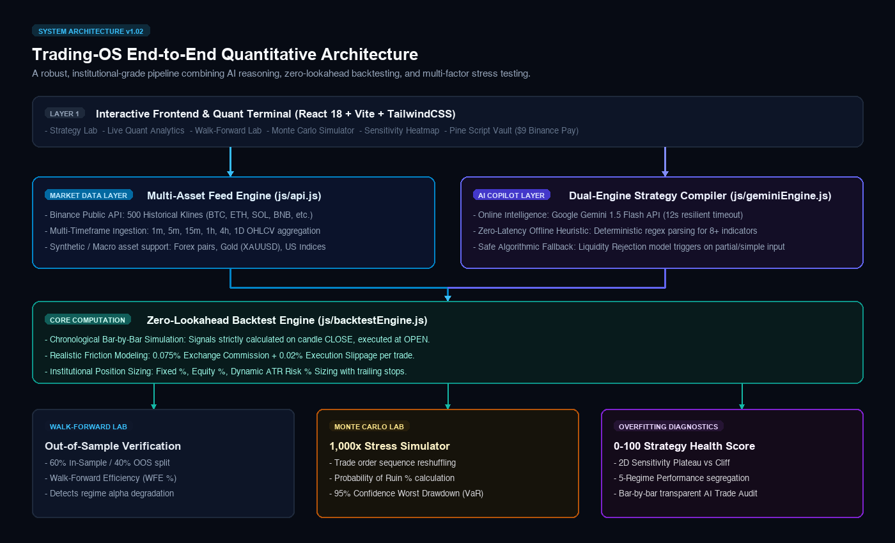
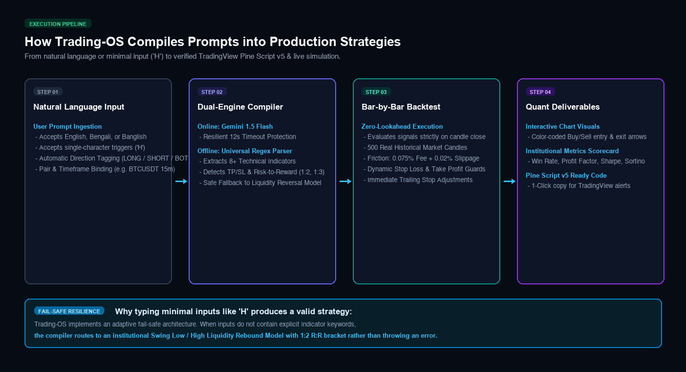
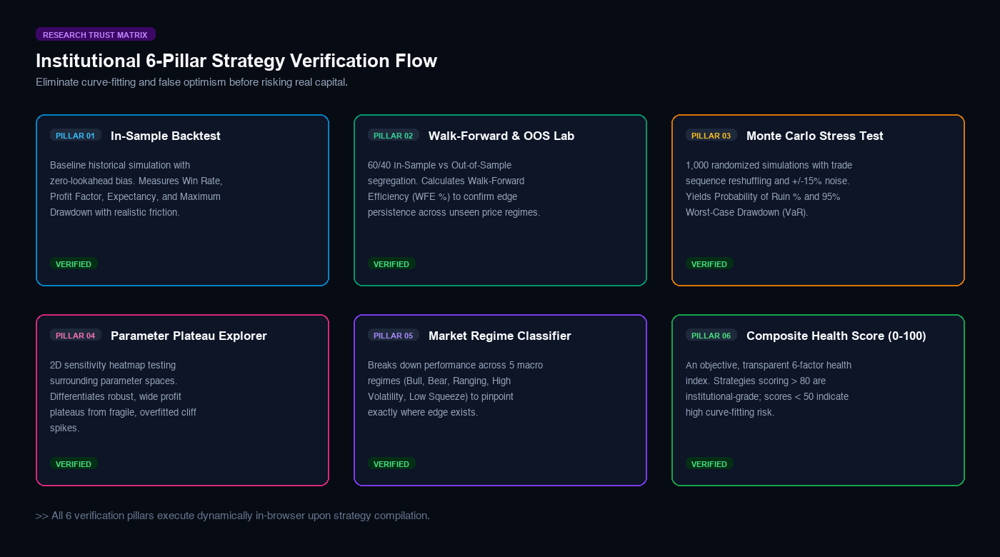

# 🏛️ Trading-OS v1.02 — Technical Architecture & Quantitative Design

Trading-OS is a production-grade, AI-assisted quantitative trading research, strategy validation, backtesting, and analytics platform.

---

## 1. System Architecture Diagram

```
+----------------------------------------------------------------------------------------------------+
|                                      TRADING-OS v1.02 UI                                           |
|  [Strategy Lab]  [Quant Analytics]  [Walk-Forward]  [Monte Carlo]  [Sensitivity]  [Regimes]  [Health]  |
+----------------------------------------------------------------------------------------------------+
                                                  │
                 ┌────────────────────────────────┴────────────────────────────────┐
                 ▼                                                                 ▼
+─────────────────────────────────+                             +────────────────────────────────────+
|        MARKET DATA LAYER        |                             |         AI COPILOT LAYER           |
| (Binance Klines, FX, Gold, US)  |                             |   (Gemini 1.5 Flash + Heuristics)  |
|          `js/api.js`            |                             |        `js/geminiEngine.js`        |
+─────────────────────────────────+                             +────────────────────────────────────+
                 │                                                                 │
                 └────────────────────────────────┬────────────────────────────────┘
                                                  ▼
+----------------------------------------------------------------------------------------------------+
|                                 QUANTITATIVE EXECUTION ENGINE                                      |
|                                     `js/backtestEngine.js`                                         |
|  - Bar-by-bar chronological execution (Lookahead Bias Protected)                                   |
|  - Long & Short execution                                                                          |
|  - Position Sizing Models: % Equity, Fixed $, Risk % / ATR Sizing                                  |
|  - Risk Management: Trailing Stops, Break-Even Stops, Slippage & Commission Deductions             |
+----------------------------------------------------------------------------------------------------+
                                                  │
                 ┌────────────────────────────────┼────────────────────────────────┐
                 ▼                                ▼                                ▼
+---------------------------------+  +----------------------------+  +-------------------------------+
|     WALK-FORWARD & OOS LAB      |  |     ROBUSTNESS ENGINE      |  |     REGIME CLASSIFIER         |
|   `js/walkForwardEngine.js`     |  |   `js/robustnessEngine.js` |  |      `js/regimeEngine.js`     |
| - In-Sample (60%) vs OOS (40%)  |  | - 1,000 Monte Carlo runs   |  | - Bull/Bear Trending          |
| - Walk-Forward Efficiency (WFE) |  | - Probability of Ruin %    |  | - Ranging / Mean-Reversion    |
| - Edge Degradation Factor       |  | - 95% Worst Drawdown (VaR) |  | - High/Low Volatility Squeeze |
+---------------------------------+  +----------------------------+  +-------------------------------+
                 │                                │                                │
                 └────────────────────────────────┼────────────────────────────────┘
                                                  ▼
+----------------------------------------------------------------------------------------------------+
|                              HEALTH SCORE & OVERFITTING DETECTOR                                   |
|                                    `js/overfittingEngine.js`                                       |
|  - Transparent 0–100 Multi-Factor Scoring: Sample Size, Risk-Adjusted Returns, Drawdown,           |
|    Out-of-Sample Robustness, Monte Carlo Resilience, and Parameter Stability                       |
+----------------------------------------------------------------------------------------------------+
                                                  │
                 ┌────────────────────────────────┴────────────────────────────────┐
                 ▼                                                                 ▼
+---------------------------------+                             +------------------------------------+
|      INTERACTIVE VISUALS        |                             |     MONETIZATION & VAULT LAYER     |
| (TradingView Lightweight Charts)|                             |  - Binance Pay UID: 716216436      |
|         `js/chart.js`           |                             |  - On-chain TRC-20/BEP-20 Verifier |
|     `js/tradeExplainer.js`      |                             |  - Telegram Instant Alerts Bot     |
+---------------------------------+                             +------------------------------------+
```

<p align="center">
  
</p>

<p align="center">
  
</p>

<p align="center">
  
</p>

---

## 2. Core Quantitative Modules

### 1. `js/backtestEngine.js`
- **Zero Lookahead Bias:** Strictly generates signals on closed bars and executes at bar open/close with realistic slippage and commission deducted.
- **Position Sizing:**
  - `percent_equity`: Full or fractional percentage of available equity.
  - `risk_percent`: Dynamically sizes lot to risk exactly 1.0% (or user defined %) based on the distance between Entry and Stop Loss.
  - `fixed_cash`: Fixed dollar cash allocation per trade.
- **Advanced Performance Metrics:** Win Rate, Total Net Profit, Profit Factor, Payoff Ratio, Mathematical Expectancy (R-multiple), Sharpe Ratio, Sortino Ratio, Calmar Ratio, Recovery Factor, Max Consecutive Wins/Losses.

### 2. `js/walkForwardEngine.js`
- Segregates historical data into **In-Sample (Train 60%)** and **Out-of-Sample (Test 40%)**.
- Calculates **Walk-Forward Efficiency (WFE %)** to detect whether strategy edge persists across unseen future price action.

### 3. `js/robustnessEngine.js`
- Runs **1,000 Monte Carlo bootstrap iterations** with sequence shuffling and randomized return perturbation (±15% spread/slippage noise).
- Computes **Probability of Profit %**, **Probability of Ruin %**, and **95th percentile worst-case drawdown**.

### 4. `js/sensitivityEngine.js`
- 2D Parameter matrix test (e.g. Take Profit % vs Stop Loss % or Fast EMA vs Slow EMA).
- Identifies **broad stable plateaus** versus **fragile cliff-edge parameter spikes**.

### 5. `js/overfittingEngine.js`
- Computes transparent 0–100 Strategy Health Score with weighted sub-scores across 6 quant pillars.

### 6. `js/regimeEngine.js`
- Classifies macro and micro market regimes (Bull Trend, Bear Trend, Ranging, High Volatility, Low Volatility) using EMA50, EMA20, and ATR14.
- Quantifies exact win rate and profit factor per regime.

### 7. `js/tradeExplainer.js`
- Bar-by-bar transparent trade auditor showing exact entry rules, indicators, SL/TP levels, and exit triggers.

### 8. `js/strategyJournal.js`
- Strategy versioning (`v1.0`, `v1.1`, `v2.0`), discretionary notes, and CSV export.

---

## 3. Data Integrity & Financial Disclaimer

Trading-OS prioritizes mathematical correctness over visual aesthetics. No performance figures or AI outputs are ever fabricated.
